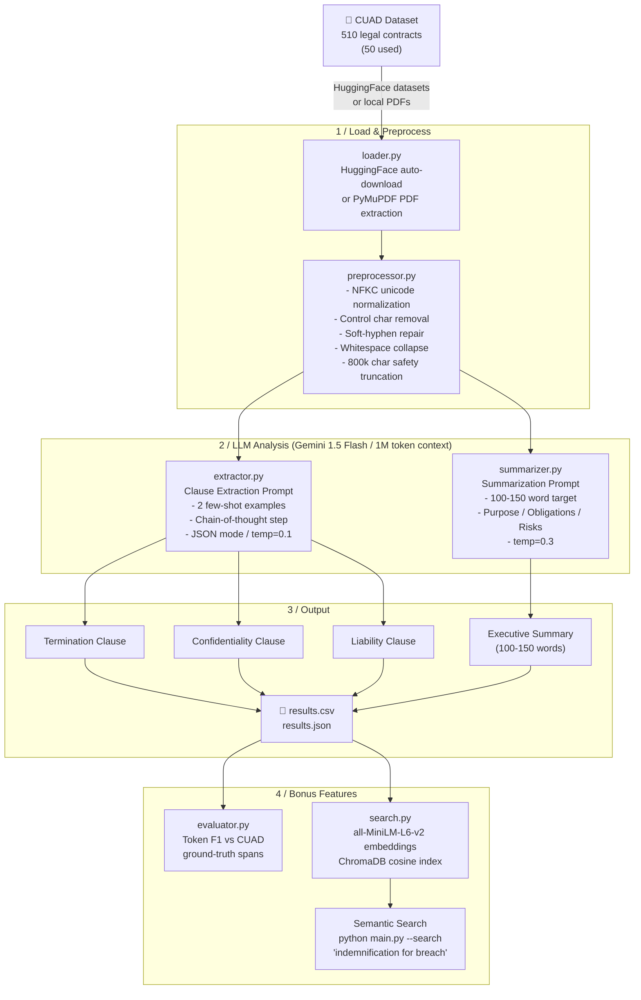

# Legal Contract Intelligence Pipeline

An end-to-end LLM pipeline for automated legal contract analysis on the [CUAD dataset](https://www.atticusprojectai.org/cuad). Extracts key clauses and generates structured summaries from 50 contracts using Google Gemini 1.5 Flash, with semantic search, ground-truth evaluation, and a Jupyter demo notebook.

---

## Pipeline Architecture



---

## Features

**Core (Task 1 + 2A + 2B)**
- PyMuPDF text extraction with unicode normalization and hyphenation repair
- Gemini 1.5 Flash clause extraction: Termination, Confidentiality, Liability
- Structured 100-150 word summaries: Purpose -> Obligations -> Risks
- CSV + JSON output with standardized schema

**Prompt Engineering Highlights**
- `<<<CONTRACT_TEXT>>>` placeholder with safe `.replace()` substitution - immune to `{curly braces}` in legal templates (avoids `KeyError`)
- Two few-shot examples per extraction prompt (multi-shot outperforms single-shot for edge-case clauses)
- Chain-of-thought reasoning step instructs the model to locate relevant sections before extracting
- Separate temperature settings: `0.1` for extraction (deterministic) vs `0.3` for summaries (fluent)

**Bonus Features**
- Semantic search: `sentence-transformers/all-MiniLM-L6-v2` + ChromaDB cosine index
- Ground-truth evaluation: Token F1 scoring against CUAD annotations (`evaluator.py`)
- Exponential backoff retry (2s -> 4s -> 8s) + `NOT_FOUND` / `EXTRACTION_FAILED` sentinels
- Jupyter demo notebook (`notebook.ipynb`)

---

## Project Structure

```
legal-contract-intelligence/
  main.py              # CLI entry point
  pipeline.py          # Orchestration + output persistence
  config.py            # All configuration (env-overridable)
  prompts.py           # Prompt templates + safe fill() substitution
  loader.py            # CUAD (HuggingFace) + PDF loading
  preprocessor.py      # Text normalization pipeline
  extractor.py         # LLM clause extraction (JSON mode)
  summarizer.py        # LLM contract summarization
  evaluator.py         # Token F1 evaluation vs CUAD ground truth
  search.py            # BONUS: Semantic clause search
  notebook.ipynb       # BONUS: Jupyter walkthrough
  sample_output/
        sample_results.csv   # Pre-computed sample (3 contracts)
        sample_results.json  # Same data in JSON format
  requirements.txt
  .env.example
  .gitignore
```

---

## Quick Start

### 1. Clone

```bash
git clone https://github.com/16PHANI/legal-contract-intelligence.git
cd legal-contract-intelligence
```

### 2. Virtual environment

```bash
python -m venv .venv

# Windows
.venv\Scripts\activate

# macOS / Linux
source .venv/bin/activate
```

### 3. Install dependencies

```bash
pip install -r requirements.txt
```

### 4. API key

```bash
cp .env.example .env
# Open .env and set: GEMINI_API_KEY=your_key_here
```

Get a **free** Gemini API key at [ai.google.dev](https://ai.google.dev) - no billing required.

---

## Usage

```bash
# Full run - 50 contracts from CUAD (downloads ~200 MB on first run)
python main.py

# Quick test - 5 contracts
python main.py --n 5

# Local PDF directory
python main.py --pdf-dir ./contracts/

# Custom output directory
python main.py --n 50 --output-dir ./results/

# Skip semantic search (faster)
python main.py --no-search

# Semantic search after pipeline
python main.py --n 10 --search "indemnification for data breach"

# Search filtered by clause type
python main.py --n 10 --search "30 days notice" --clause-type termination_clause

# Evaluate against CUAD ground truth
python evaluator.py --results output/results.json
```

> **First run:** CUAD downloads automatically (~200 MB). Subsequent runs use the local cache (`~/.cache/huggingface/`).
> **Runtime:** ~8-10 minutes for 50 contracts (4s rate-limit delay per API call * 2 calls * 50 contracts).

---

## Output Schema

`output/results.csv` and `output/results.json`:

| Field | Type | Description |
|---|---|---|
| `contract_id` | string | CUAD contract identifier |
| `summary` | string | 100-150 word executive summary |
| `termination_clause` | string | Verbatim termination provision, or sentinel |
| `confidentiality_clause` | string | Verbatim confidentiality clause, or sentinel |
| `liability_clause` | string | Verbatim liability/indemnification clause, or sentinel |

Sentinels: `NOT_FOUND` (clause absent) / `EXTRACTION_FAILED` (API error after retries)

---

## Design Decisions

### Why Gemini 1.5 Flash?

The 1-million-token context window processes **entire legal contracts in a single API call** - no chunking required. Chunking fragments cross-section context (e.g., a liability cap defined by a termination condition in a different section), which degrades extraction accuracy. CUAD contracts range from 20,000 to ~150,000 tokens - all fit comfortably in one call.

### Safe Prompt Substitution

Standard Python `.format()` raises `KeyError` when legal text contains `{variable-like}` patterns (common in boilerplate legal templates). V2 uses a `<<<CONTRACT_TEXT>>>` placeholder with `str.replace()` substitution via the `fill()` function - completely immune to curly brace content in contracts.

### Prompt Engineering

Multi-shot prompting (2 examples) outperforms single-shot for legal clause identification because legal language is highly formulaic - exa